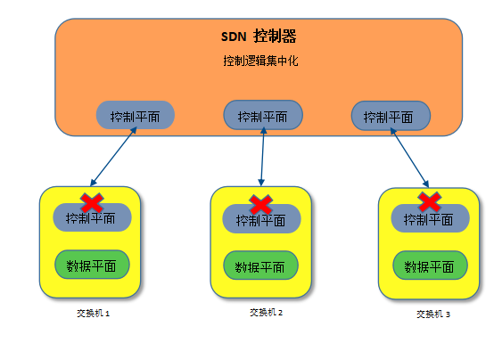
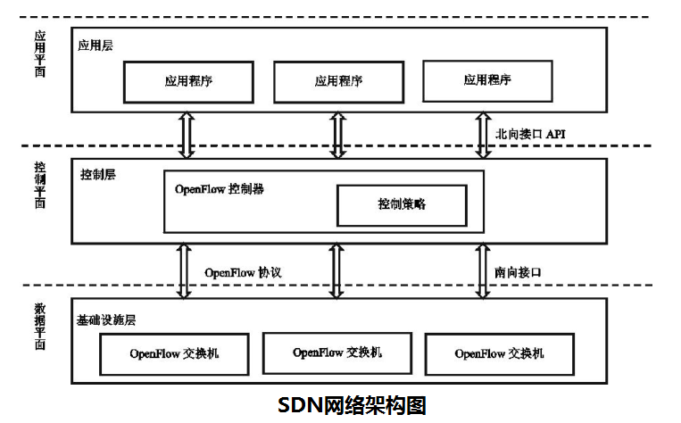
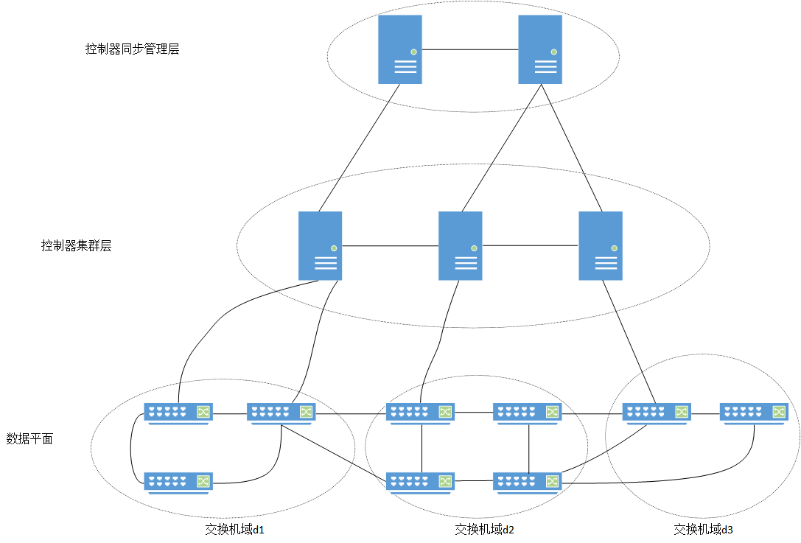
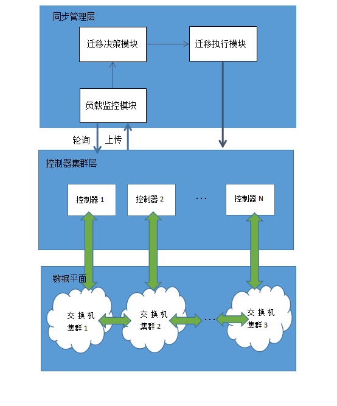
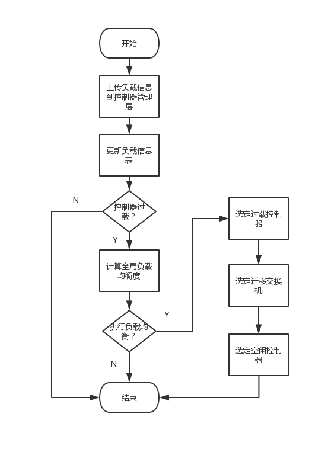
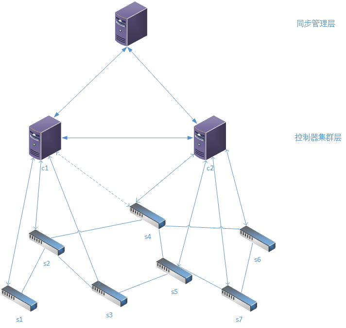

摘要

摘要  

近年来，软件定义网络（SDN）已经成为管理包括数据中心和云计算网络在内的大规模网络的流行范例。作为一种新型网络架构，SDN仍然存在着大量未解决的难题。本文研究了SDN控制平面的扩展性问题和负载均衡问题。通过对SDN网络的控制平面通信机制，以及基于Openflow协议的南向接口数据平面数据转发过程的研究，分析了影响网络负载均衡的几个关键因素，并针对现有的负载均衡算法的缺陷进行了优化。为进一步降低SDN控制器间的通信开销，本文提出了一种控制平面分层的网络架构，并以此提出一种交换机迁移算法，以解决网络的负载均衡问题。

首先，本文将控制平面的管理功能剥离出来，形成一个独立的功能层，用以管理控制平面的控制器集群。各层之间相互独立，通过通信接口完成信息传递，降低了控制平面间控制器通信造成的负载，并通过仿真实验对网络架构进行了验证。

其次，本文调查分析了多种现有的交换机迁移算法，总结了这些算法的优缺点，并针对部分不足之处进行设当改进，进而提出了一种预测式的交换机迁移算法。该算法针对迁移交换机的迁移负载进行针对优化，提高了算法的负载均衡效率，并搭建环境进行仿真实验，验证了算法的性能。

关键词：软件定义网络、负载均衡、交换机迁移算法、Openflow协议

第一章&nbsp;&nbsp;绪论

## 1. 第一章&nbsp;&nbsp;绪论

### 1.1 **课题研究的背景及意义**

近年来，信息技术得到了飞速的发展，大数据、云计算及物联网等新兴技术层出不穷，并得到了广泛的应用，给传统网络架构带来了巨大的挑战。然而，传统的TCP/IP网络在设计之初并未考虑到网络的扩展性问题，这使得网络在后期扩展中不得不添加新的模块和协议到网络设备中，造成了整个网络结构臃肿、资源利用率低下等一系列问题。研究发现，传统网络结构最大的弊端在于拓扑的僵化，即控制平面和数据平面高度集中，使得网络设备功能繁杂且迭代缓慢，因此，未来网络架构亟待控制器平面和数据平面的解耦。在此背景下，产业界和学术界对未来网络进行了探索，以解决当前TCP/IP网络架构中面临的诸多挑战。其中最为出名且已经落地的网络架构有SDN(软件定义网络)[1]、CDN(内容分发网络)、IPv6等。其中SDN对网络的发展产生了巨大的影响。  

SDN起源于斯坦福大学的Clean Slate研究科题，该项目获得了美国自然科学基金会(NSF)以及工业界的支持，其目标是通过采用全新的技术和应用服务来打破当前互联网的基础架构限制。在此目标的驱动下，Clean Slate项目组进行了大量的研究，发表了众多影响极大的论文，产生了包括Openflow[2]和SDN、POMI2020、Mobi社会实验室等项目。Clean Slate项目在2007年SIGCOMM会议上明确提出了Ethane网络架构，第一次将计算机网络的控制和转发功能分离，提出了“控制器”这一概念。随后，在2009年Nick McKeown等人在当年的SIGCOMM会议上发表了Openflow协议，被麻省理工学院和多家咨询机构评选为未来十大技术之一，标志着SDN技术的正式推出。  

利用分层的思想，SDN实现了逻辑控制与数据转发的解耦[3]，形成逻辑控制平面和数据转发平面。在控制层，包括具有逻辑中心化和可编程的控制器，可掌控全局网络信息，方便运营商和科研人员管理网络和部署新协议等；在数据层转发层，交换机只提供简单的数据转发功能，可快速处理匹配的数据流，适应日益增长的流量需求。控制层和数据转发层之间采用统一的接口进行交互，控制器通过该接口向交换机下发指令，交换机只需按照这些指令执行相应的动作即可。与传统网络相比较，SDN降低了设备负载，更有利于协助运营商管理基础设施，降低运营成本。如图1.1所示，控制器是通过将传统网络中路由器的功能抽离出来得到的一种新型网络设备。  

图1.1 SDN网络的变化
  

然而，随着网络规模的不断扩大，尤其是面向云计算网络和数据中心网络，控制逻辑高度集中的SDN控制器已是不堪重负。考虑到高密度服务对硬件设施的需求，单控制器管理范围和处理能力极为有限，因此限制了控制平面的扩展性。研究表明，在理想状态下，单控制器可以管理上百台交换机[4]，然而这仅仅是杯水车薪。为了提高控制平面的可扩展性，最常见的做法是部署分布式控制器[5]，采用控制器集群的方式处理网络的实时请求，而这也带来了控制平面的负载均衡问题。为了有效解决多SDN控制器部署方案中控制器之间负载不平衡的问题，需要实时监控和共享SDN控制器之间的负载情况，从而设计出一种机制使得在控制器失效或控制器负载过大时能够将SDN交换机迁移到其他正常的或负载较轻的控制器，避免控制器单点失效或者负载过大。

### 1.2 **研究现状**
近些年来，SDN的研究已经成为学术界、产业界的热点，尤其是对控制平面负载均衡的研究。
文献[6]首次提出了迁移交换机的思想实现负载均衡，该方案以控制器与交换机之间的传输时延作为交换机迁移的度量值，并研究了控制器的不同部署方案对对交换机迁移负载的影响，然而该方案只是进行了理论上的描述，并未使用数学原语进行证明。
文献[7]提出了一种弹性的分布式控制器部署架构ElasticCon，该方案增加了对负载的自适应决策，即通过设置负载的上下门限值来评估控制器的负载状态，当控制器负载超过上、下门限值时，通过迁移交换机来实现控制平面的动态负载均衡。然而，ElasticCon架构并未考虑多控制器同时过载的情况。
文献[8]提出以设备的网络流量判定负载，因此，该方案增加了网络流量监测模块，实时监测网络中流量的动态变化，根据交换机发出的流请求速率适当迁移交换机来平衡全局负载。但该方案也会增大控制器间的通信负载。
文献[9]首次提出了分离控制平面的控制器架构，形成两层控制器，底层的控制器集群无需相互通信，只需维护自己的网络视图，由上层控制器采用逻辑上集中的控制来维持全局的网络视图，而这也使得两层控制器需要不断进行通信，导致网络通信开销的增大。
文献[10]提出了一种控制器休眠的优化方案，该方案规定在平衡负载的同时考虑资源利用率，控制网络在轻流量的状态下允许控制器进入休眠状态以节省资源，利用数学定理定量分析系统性能，构造全局损耗函数以寻求最优解。
文献[11]提出了一种利用率最低迁移策略，从资源利用率的角度定义交换机迁移的策略，选取资源利用率最低的控制器作为交换机的迁移目标，在负载均衡同时也提高了网络的资源利用率。

第二章&nbsp;&nbsp;SDN网络和负载均衡算法概述

## 2. 第二章&nbsp;&nbsp;SDN网络和负载均衡算法概述

### 2.1 **SDN架构**
根据不同的需求，许多组织参与了SDN架构的研究，如开放网络基金会（Open Networking Foundation，ONF）、互联网工程任务组的ForCES工作组、互联网研究专门工作组的SDNRG研究组、国际电信联盟远程通信标准化组织的多个工作组、欧洲电信标准化组织，等等。其中，ONF制定的基于OpenFlow协议的SDN架构，得到了业界普遍认可，如下图2.1所示。

图1.2 SDN网络架构
  

由图可以看出，SDN网络架构打破了传统TCP/IP的四层网络架构，将网络网络架构划分为三层：基础设施层、控制层和应用层，形成数据平面、控制平面和应用平面。  

(1) 数据平面即是SDN网络的基础设施层，由若干个Openflow交换机组成，这些底层转发设备与传统网络设备中的Hub类似，并不具备控制功能，只是起到网络数据转发和处理相应数据的功能。数据平面采用最为广泛的南向接口协议Openflow所定义的流表完成数据转发，完全的替代了传统网络中的交换设备。当Openflow交换机接收到网络数据包时，首先和交换机内流表的流表项进行匹配，若匹配成功，则根据流表项的目的地址转发数据包；若此时交换机内全部的流表都无法与之匹配，则将数据包发送到控制平面，由控制器进行路由处理并下发流表（路由规则）到相应的交换机设备。  

(2) 控制平面由逻辑控制器组成，主要负责两个基本任务，一是负责下达路由策略、转发命令和维护全网视图，这种集中化智能的设计简化了网络服务的提供，优化了性能，实现了细粒度的策略管理。二是为SDN应用平面提供底层网络的抽象模型，为上层应用的调用提供接口，简化了网络具体应用的开发，提高了网络的安全性。  
<!-- (3) 应用平面是一些具体的SDN应用，用户可以不关心底层的具体技术细节，仅通过简单的编程来完成新应用的快速部署。应用层通过北向接口与底层网络交互，完成应用快速热部署。北向接口提供了大量的应用开发API，网络的开发人员可以通过这些API与控制平面进行信息交互，完成多种多样的网络需求。然而，北向接口缺乏统一编程规范，这使得其发展十分缓慢。 -->

(3) SDN应用层是SDN架构中的最顶层，这一层也是SDN可编程的体现。这一层的应用（如商业应用）通过SDN北向接口与SDN控制器进行通信。SDN应用无需考虑网络底层网元的具体配置和性能，只需将应用的功能分解为SDN控制器能执行的粒度发送至SDN控制器，以实现应用的功能。这样的设计使得应用开发者能不受具体网络的限制，将主要精力放在应用本身的功能实现和性能改善上面，从而在不同网络上实现创新，加快了新功能和服务升级的速度。  

(4) SDN北向接口提供了SDN应用层和SDN控制层之间的通信实现。SDN使用北向接口与SDN控制层之上的SDN应用层进行通信，这有助于网络管理员进行编程实现流量和部署服务。然而，目前北向接口还没有统一的规范。  

(5) SDN南向接口提供了SDN控制层和基础设施层（Openflow交换机）之间的通信实现，其协议的标准化程度要比北向接口协议标准化程度高。

### 2.2 **ONOS控制器相关介绍**
ONOS[12]是Open Network Operating System的缩写，即开放网络操作系统。ONOS是一款基于集群的分布式操作系统，具有可扩展性、高可用性、高性能以及南北向接口的抽象化，当网络规模和应用需求发生变化时，ONOS能在水平方向上随之快速变化以适应业务上的需求。ONOS采用SDN控制器的经典架构，其突出优势是分布式核心。ONOS控制器分为5层，包括应用层(Apps)、北向核心API(NB Core API)、分布式核心(Distributed Core)、南向核心API(SB Core API)、转发层(包括适配器Adapters和协议Protocols)。
<!-- ONOS架构如图2.2所示。 -->
### 2.3 **Openflow交换机**

OpenFlow交换机由安全通道、流表、OpenFlow协议 三部分组成。
(1) 安全通道
安全通道是连接OpenFlow交换机和控制器通信的接口。控制器通过这个接口来控制和管理OF交换机，同时OF交换机通过这个接口将事件传给控制器，发送数据包，并接收来自控制器下发数据包。
控制器和交换机必须通过安全通道进行通信，而且进行通信的数据包必须按照OpenFlow协议规定的格式执行。
(2) 流表
流表是数据转发的依据，与交换机的mac地址转发表和IP地址路由表类似，流表中保存了网络中各个层次的网络配置信息，因此可以进行更加丰富的转发规则。交换机收到来自主机的数据包后，会在本机查询对应的动作，和对应的输出端口。
(3) Openflow协议
Openflow协议提供了SDN控制器与底层网络设备(交换机等)之间的通讯标准，允许SDN控制器下发转发规则(forwarding rules)、安全规则(security rules)到底层Openflow交换机，完成路由决策、流量控制。

### 2.4 **交换机迁移相关算法介绍**
#### 2.4.1 **DDM算法**
文献[13]提出了一种基于多子域SDN网络中交换机迁移的分布决策机制（DDM）。DDM通过收集网络信息，根据控制器负载情况构建分布式迁移决策域(MDF)。然后根据交换机与控制器的距离和流请求率的综合概率选择迁移交换机，通过综合考量三种网络开销确定目标控制器，包括数据采集，交换机迁移和控制器状态同步。其中，迁移决策域的选择具有两个特点：(1)保证网络同时有多个迁移决策域可供迁移选择。(2)不同的迁移决策域之间没有交集。DDM是以渐进的方式实现的，其流程主要包括三个阶段。第一阶段，通过对网络信息的采集，建立了分布式迁移决策场(MDF)。第二阶段，迁移交换机和目标控制器根据每个MDF中不同的网络参数确定。第三阶段，实现了切换迁移，并对相应的控制器角色进行了转换。
#### 2.4.2 **DHA算法**
文献[14]设计了一种针对交换机迁移问题提出了DHA(Distributed Hopping Algorithm)算法，该算法定义了可量化的控制机制决定交换机迁移方案。首先，该算法定义了SDN模型从负载的角度来描述交换机与控制器之间的联系，然后，基于此网络模型将交换机迁移问题转化为网络资源利用率最大化问题。在交换机迁移策略中，限制总负载不能超过控制器的物理极限以及每个交换机的上限，以避免小部分交换机耗尽控制器资源，并规定每台控制器所管理的范围不能重叠，即一台交换机同时只有由一台控制器管理。DHA在每台控制器上部署了负载监控模块、DHA决策模块以及分布式存储模块。最终在真实的网络环境中进行测试，结果表明DHA算法在流表安装时间、通信负载以及平均资源利用率上有明显优势，有效提高了分布式控制平面的性能和可扩展性。

#### 2.4.4 **BalCon和BalConPlus算法**
文献[15]证明了交换机和控制器之间的动态映射可以提高管理流量负载变化的效率，并由此提出了平衡控制器算法BalCon和BalConPlus两种SDN交换机迁移方案，以实现SDN控制器之间的负载平衡，且降低了迁移成本。其中，BalCon是一种响应式算法，只有过载控制器才能激活BalCon，因此适用于网络不需要切换请求的串行处理的场景，而对于其他情况，BalConPlus更适合，因为它不会收到交换机迁移中断的影响，并且不会导致任何的服务中断。仿真结果表明，Balcon将控制器之间的负载不平衡(以负载的方差表示)降低了40%，减少了过载控制器约19%的负载，也使得SDN交换机迁移的数量相对较少。

第三章&nbsp;&nbsp;基于交换机迁移的负载均衡算法模型

## 3. **第三章&nbsp;&nbsp;基于交换机迁移的负载均衡算法模型**

### 3.1 **控制器部署架构**
目前的分布式控制器架构在解决控制平面的扩展性问题的同时也带来了控制平面的负载平衡问题。目前，大多数的控制平面负载均衡算法均是通过迁移交换机来平衡各控制器间的负载，但由于控制平面不断扩大，控制器间网络视图的通信也会随之增加，而这往往会对控制器的性能造成一定影响。负载均衡的设计中，各控制器间网络状态的通信属于其算法的副产品。考虑到控制平面应主要负责制定分组转发策略，因此可以将负载均衡策略独立出来，从而降低通信负载。本章将当前控制器集群进行业务分离，形成控制器同步管理层和控制器集群层。
(1) 控制器同步管理层
同步管理层包含负载监控模块、迁移决策模块和迁移执行模块。控制器同步管理层站在全局的角度上管理整个控制器集群的负载情况，通过接受来自控制器集群上传的控制器负载形成整体网络的负载信息表，其中包括了控制器集群层负载以及所控制的交换机负载。
(2) 控制器集群层 
集群内控制器必须周期性得向同步管理层发送当前交换机域内的负载信息，随后由同步管理层依据相关算法做出相应的负载均衡策略。控制器集群层中，每台控制器管理一个交换机集群，且控制器间无需相互同步拓扑信息和负载信息，因此在一定程度上降低了控制器的通信负载。集群内控制器的网络视图由同步管理层控制器下发，从而正常处理跨控制器的数据转发。
(3) 数据平面
数据平面包括交换机和链路等基础设施，接受控制器指令执行相应的操作。利用Openflow交换机的特性，配合Openflow协议的优点完成网络数据正常处理。

图3.1 SDN网络部署架构

### 3.2 **符号说明**
| 符号 | 说明 |
| :----: | :----: |
| M | 交换机节点数 |
| N | 控制器节点数 |
| $D=\{d_1,d_2,\cdots,d_N\}$ | 单控制器域集合 |
| $S=\{s_1,s_2,\cdots,s_M\}$ | 交换机集合 |
| $C=\{c_1,c_2,\cdots,c_N\}$ | 控制器集合 |
| $H_{s_i}^{c_j}$ | 交换机$s_i$到控制器$c_j$之间的跳数 |
| $r(s_i,c_j)$ | 交换机$s_i$与控制器$c_j$的连接关系，即当$s_i$与$c_j$联通值为1，否则为0 |

### 3.3 **负载均衡策略**

本章针对现有解决方案的缺点提出了几点优化：(1) 考虑了交换机的部署位置对迁移产生的影响。(2) 针对控制器内请求特征的排队模型考虑其负载。

该负载均衡策略的整体结构图

该算法的流程图如图3.3所示，首先，控制器集群层控制器会周期性地上传自身维护的控制器域的负载信息到控制器同步管理层，然后，由管理统一信息后制定相应的负载均衡策略，并向下层控制器发送相应指令。这一控制逻辑主要由该算法的三大模块完成：(1)负载监测模块，负责收集控制器集群内的负载信息，并根据负载情况决定是否激活负载均衡策略。(2)迁移决策模块，依据网络负载信息计算出交换机迁移的具体方案。(3)迁移执行模块，依据上述模块发出的指令实施相应的迁移动作。

图3.3 算法流程图

#### 3.2 **负载监测模块**
在本章所设计的网络架构中，我们关注控制器、交换机的负载，并且从全局的控制器负载的差异程度考虑全局的负载平衡性。研究发现，SDN控制器的负载主要由以下因素决定：(1)处理packet-in消息负载(2)维护本控制器管理的网络视图。  
每个控制器均管理着多个交换机，这些交换机产生的packet-in请求由控制器全权处理
##### 3.2.1 **控制器负载监测**
在控制器集群层中，控制器充当着整个网络的"大脑"，每个控制器均管理着多个交换机，这些交换机产生的packet-in请求由控制器全权处理。控制器负责分析传输至控制器的数据包的信息，根据内部的网络拓扑图解析流表内容生成流表项目，并需要将流表发送至指定设备。因此，控制器负载主要来自路由计算和各个设备的信息收集。 

<!-- 在本章设计的网络架构中，控制器集群中每个控制器可以管理多台交换机，连接控制器的交换机所产生的packet-in请求都将发送给控制器，并排队等待控制器处理。因此，在单控制器域中，packet-in请求的发送符合M/M/1排队模型。 -->
1. 控制器路由机制负载

 基于3.1提出的控制器部署架构，集群控制器通过南向接口Openflow协议，接受由底层Openflow交换机发出的packet-in请求后，通过控制器内维护的网络拓扑计算出交换机请求数据包的路由路径，封装形成流表，通过Openflow安全通道将流表下发给路径中的所有被管理的交换机。通过分析集群控制器的数据处理流程，我们将控制器路由机制负载分为packet-in消息处理负载以及流表下发负载。

  定义一： packet-in消息处理负载  
    
$$f_{packet}(c_m)=P_s\cdot\sum_{s_i\in S}\sum_{c_m\in C}r(s_i,c_m)\cdot H_{s_i}^{c_m}$$(1)
其中，$P_s$表示packet-in消息的平均长度。

定义二：流表下发负载
$$f_{flow}(c_m)=\sum_{s_i\in S}\alpha_{s_i} \cdot H_{s_i}^{c_m}\cdot r(s_i,c_m)$$(2)
其中，$\alpha_{s_i}$表示交换机$s_i$的平均流量。

因此，对于控制器$c_m$来说，路由机制的负载$F_p(c_m)$主要由packet-in消息处理负载$f_{packet}(c_m)$和流表下发负载$f_{flow}(c_m)$组成，即：

$$F_p(c_m)=f_{packet}(c_m)+f_{flow}(c_m)$$(3)

<!-- 式(2)中，$P_s$表示packet-in消息的平均长度，式(3)中$\alpha_{s_i}$表示交换机$s_i$的平均流量，$h_{im}$表示交换机$s_i$到控制器$c_m$的跳数。  -->

2. 控制器信息收集负载
在本文所设计的SDN网络架构中，同步管理层控制器需要收集集群层各控制器的网络拓扑和数据层中的各Openflow交换机的流量信息以同步全网络拓扑。因此，控制器信息收集负载$F_{data}(c_m)$由交换机收集负载$f_{info}(c_m)$和视图上传负载$f_{upload}(c_m)$组成。

定义三： 交换机信息收集负载
一个控制器管理着多个交换机，因此，控制器收集交换机信息产生的负载可以表示为交换机的平均流量与交换机数量的乘积，即：
$$f_{info}(c_m)=\exp \left(\alpha_{s_i} \cdot |S_{c_m}|\right)$$(4)

其中，$|S_{c_m}|$表示控制器$c_m$所管理的交换机数量。

定义四： 控制器域拓扑上传负载   
视图上传负载是由本文设计的控制器部署架构带来的“副产品”，但相较于集群信息同步负载更小，
  交换机域内交换机的数量*负载因子  
$$ f_{upload}(c_m)=\exp\left(|S_{c_m}|\right) $$(5)

由此控制器信息收集负载表示为：
$$ F= f_{info}(c_m)+f_{upload}(c_m)$$(6)

因此，控制器负载是上述两个因素的二元线性函数，表示为：
$$L(c_m)=\sigma_1\cdot F_{data}(c_m)+\sigma_2\cdot F_p(c_m)$$(7)
$$s.t. \quad \sigma_1+\sigma_2 = 1$$

在控制器集群层中，负载信息描述为一个负载三元组，包含控制器节点$c_m$、控制器负载值$L(c_m)$和控制器负载状态$I(c_m)$（控制器过载，I=1；否则，I=0；默认为0），如图3.4。

$$\left( c_m,L(c_m),I(c_m) \right)$$

控制器负载监测模块接收到控制器集群层上传的负载信息后写入负载信息三元组，当控制器$c_m$的负载值大于临界值$\mu$时，设置负载状态为I=1，表示控制器过载；若负载值小于或等于$\mu$时，设置负载状态I=0，表示此时控制器正常运行。负载信息上传完成后，负载监测模块将根据各控制器负载状态值确定过载控制器，继而执行迁移决策模块。相比于控制平面高度集中的交换机迁移方案，本章描述的算法通过分离控制平面的任务实现"分工合作"，有效降低了集群控制器间的通信负载，使得控制器只需专注处理数据平面的Openflow消息，从而强化了网络的工作效率。

##### 3.2.2 **交换机负载监测**
在SDN中，每个控制器管理着多个交换机，交换机仅仅处理数据包的转发与流表（路由规则）的安装，只有当交换机收到一条新的流时才会向控制器发送packet-in请求，请求控制器计算数据包的路由路径，因此交换机的性能上限由其硬件组成决定。故而在本模型中，交换机的负载可直接表示为packet-in请求的发送率$\beta_{s_i}$(每秒发送的packet-in请求数)，即：

$$ F(s_i)= \beta_{s_i}$$(8)

由同步管理层控制器管理着全局网络的交换机负载信息，其表述为：

$$\left( c_m,F(s_i) \right)$$

该二元信息表用于描述集群层中各控制器维护的路由器集群的负载值，当交换机发送的packet-in请求越频繁，表明交换机的负载越高。
##### 3.2.3 **全局负载平衡性测算**

定义五：负载差异度$d(c_m,c_n)$表示控制器$c_m$与$c_n$之间负载值的差异程度，$d(c_m,c_n)$的计算公式如下：

$$d(c_m,c_n)=\frac{L(c_m)}{L(c_n)}$$(9)
式(9)表示若两个控制器之间的负载差值越大，则表示差异度越高。

定义六：控制器负载差异矩阵R  
    用于描述控制器集群层各控制器间的负载差异程度的矩阵
$$ 
R=
    \left[
        \begin{matrix}
            d(c_1,c_1) & d(c_1,c_2) & d(c_1,c_3) & \cdots & d(c_1,c_n)\\
            d(c_2,c_1) & d(c_2,c_2) & d(c_2,c_3) & \cdots & d(c_2,c_n)\\
            \vdots & \vdots & \vdots & \vdots & \vdots & \\
            d(c_n,c_1) & d(c_n,c_2) & d(c_n,c_3) & \cdots & d(c_n,c_n)\\
        \end{matrix}
    \right]
$$(10)

定义七：负载临界值$T$用于描述集群层控制器负载的极限值，若$L(c_m) > T$，表示控制器$c_m$过载，需设置负载信息三元组值$I=1$；若$L(c_m) < T$，表示控制器$c_m$负载情况正常，设置负载信息$I=0$。负载临界值$T$表达式如下：

 $$ T=\frac{\max R-\min R}{\max R} $$(11)

<!-- 我们设定控制器的负载判断方法为$|d(c_m,c_n)-d(c_n,c_m)|>T$ -->
<!-- 
我们用拓扑中任意两个控制器负载之比表示控制器的负载差异
$$\eta=\frac{1}{M-1}\cdot \sum_{m=1}^M(L(c_m)-\overline{L})^2$$(7) 
-->

### 3.3 **迁移决策模块**
由于本章的主旨是平衡控制器集群的负载，而不是仅仅减轻某个控制器的负载，因此，负载控制器是一个相对的概念，在选举的过程中应选用设当的算法控制器过载控制器的数量，避免出现大量控制器出现过载的现象。
#### 3.3.1 **过载控制器选举**

根据负载阈值$T$选举过载控制器,负载超过该阈值的控制器即为过载控制器，需要执行交换机迁移动作来降低负载。由同步管理层检索控制器负载元组属性$I$，若值为1，则将该控制器放入过载控制器列表；若值为0，则放入空闲控制器候选列表。

#### 3.3.2 **迁移交换机选举**
当选定过载控制器后，即在该控制器下选择需要迁移的交换机来减轻该过载控制器的负载。在选择交换机过程中，需要考虑的因素有：

(1)交换机负载  
由式(8)表示，即$F(s_i)= \beta_{s_i}$

(2)资源利用率
鉴于每台交换机都可能会向Master控制器发送packet-in请求，在控制器统计数据后用交换机$s_i$发出的packet-in请求数所占packet-in请求总数的比例表示该交换机$s_i$占控制器$c_m$利用率，表达式如下：
$$ u_{im}=\frac{\alpha_{s_i}}{\sum_{s_i \in S_{c_m}} \alpha_{s_i}}  $$(12)

本文设计的算法综合考虑控制器$c_m$管理的交换机域中交换机的负载与交换机与控制器之间的距离（本文中将距离设置为跳数）。 根据选出的控制器, 对其管理的交换机集群进行迁移概率计算. 考虑到交换机的迁移对网络自身的数据传输等业务会产生一定影响, 因此被迁移的交换机请求率不宜过大。 因此，当迁移的交换机对其控制器上的资源利用率较小，迁移交换机负载较大，且与控制器之间的跳数较大, 可以将迁移对整个网络的造成的扰动影响降至最低.

交换机选举概率$P_{im}$为：
$$P_{im} = \exp\left( \frac{u_{im}\cdot F(s_i)}{H_{s_i}^{c_m}\cdot (1-u_{im})}\right)$$(13)
公式(13)综合考虑了交换机$s_i$的负载$F(s_i)$、对控制器$c_m$的资源利用率和与控制器$c_m$之间的跳数$H_{s_i}^{c_m}$。计算出的$P_{im}$值越大表示交换机被迁移的概率越高。

##### 3.3.3 **接收控制器选举**

在大多数交换机迁移算法中，接收控制器的选举都是根据与过载控制器之间的距离选择的，即尽可能选择离过载控制器近的控制器，但这样可能造成临近设备负载值增大，导致控制平面负载不均衡。为了平衡控制器的负载，提高控制平面的扩展性，我们更倾向于选择距离近的低负载控制器作为接收控制器，并且为了尽可能减少后期的负载均衡操作，在计算接收控制器概率的同时，考虑迁移损耗以避免造成服务中断。
在计算交换机的迁移损耗时，主要考虑迁移交换机$s_i$到拟选择的接收控制器$c_n$之间的连通关系、交换机$s_i$迁移前后距离其Master控制器之间跳数之差以及该交换机的平均流量。

$$cost=P_{s}\cdot \sum_{s_i\in S} r(s_i,c_n)+ \alpha_{s_i} \cdot |H_{s_i}^{c_n}-H_{s_i}^{c_m}|$$(14)
其中，$r(s_i,c_j)$为交换机$s_i$与控制器$c_j$之间的连接关系，若交换机与控制器之间连通，值为1；否则为0。

综合迁移负载与控制器自身负载以及过载控制器与接收控制器跳数因素，可以计算出接收控制器的选择概率$P_{c_m}^{c_n}$。
$$ P_{c_m}^{c_n} = \exp{\left( \frac{|T-d(c_m,c_n)|}{cost\cdot d(c_m,c_n)} \cdot H_{c_m}^{c_n}   \right)} $$(15)
式(15)计算得出的$P_{c_m}^{c_n}$值越大，表示控制器的优先级越高且越容易选中作为接收控制器。
### 3.4 **迁移执行模块**
当同步管理层完成迁移决策后，便激活迁移执行模块，执行交换机迁移动作。交换机迁移流程根据Openflow协议的主备原则制定，Openflow协议规定进行，
Openflow v1.5规定交换机可以与多个控制器建立连接，当一个交换机同时与多台控制器连接时，引入Role作用，每个控制器具有三种Role，分别为Master、Equal、Slave，三种Role具有不同的权限。
Role角色解析：  
Equal：  
默认的Role为Equal。当为Equal时，各个控制器具有相同的作用，也可以对OpenFlow交换机进行完全访问。Equal控制器可以对交换机发送Flow-Mod消息，变更交换机设置，在默认设置中，OpenFlow交换机向Equal控制器发送所有的异步消息。  
Master：    
对于Master控制器，具有和EQUAL相同的权限，但是一个拓扑中只能存在一个Master，一个OpenFlow交换机只能与一个Master控制器连接，同时，其他的控制器被置为Slave。    
Slave：  
当交换机为Slave时，OpenFlow控制器只能对OpenFlow交换机进行Read-Only访问，只要不指定异步消息，将不能向Slave发送除Port-Status消息之外的消息。

其大致步骤如下：
(1)控制器集群层收到管理层控制器发出的迁移指令后，向数据平面选举的迁移交换机下发命令，封锁其各个端口接收数据，并等待交换机完成缓存中的数据发送，防止因交换机迁移产生的服务中断。
(2)交换机完成缓存服务后断开与其Master控制器的连接，根据决策模块挑选一台控制器作为交换机的Master控制器。
(3)通过Openflow协议的控制功能将选定的Slave控制器设置为该交换机的Master控制器。
(4)由迁移后的Master控制器获得交换机的完全控制权，并解锁交换机端口，允许其正常转发数据。

其具体过程如图3.4

网络经由负载监测模块和迁移处理模块处理后，发现控制器c2过载，并且发出s4->c1的迁移请求。
(1)控制器同步管理层向控制器集群中的过载控制器c2和目标控制器c1发送交换机s4的迁移指令。然后，控制器c1与c2接收到迁移指令后相互握手建立迁移的交互关系，关系建立完毕后，由过载控制器c2发送开始迁移消息，目标控制器c1收到迁移开始的消息后向选定的迁移交换机s4发送更改控制器Role的指令，利用交换机中依据Openflow协议设定的Controller roles属性将控制器c1角色从Slave更改为Master，并将控制器c2角色变更为Slave，交换机完成迁移后向目标控制器发送迁移完成信息，由c1将消息通知同步管理层，至此，迁移结束。

第四章&nbsp;&nbsp;系统部署与验证

## 4. **第四章&nbsp;&nbsp;系统部署与验证**

对于第三章设计的交换机迁移算法，有本章验证其分布式环境下的数据转发功能以及对交换机迁移算法的效用和性能的测试。
### 4.1 系统部署
实验环境为Ubuntu16.04虚拟机，并利用docker[16]环境部署三个ONOS控制器模拟控制器集群，选择ONOS版本为1.15.0，根据第三章设计的三层网络架构，设置控制器1作为同步管理控制器，其余控制器2和3作为集群层控制器，控制器ONOS集群包含多个ONOS节点，每个ONOS控制器拥有唯一的节点ID，每个ONOS节点管理连接的交换机集群，各节点间通过atomix传递消息，并且通过内部Store组件存储信息并将上传信息到同步管理层。ONOS节点连接到外部Atomix集群以进行数据存储和协调。连接后，ONOS节点通知Atomix其存在和位置。然后，Atomix将新节点的信息广播到所有其他连接的ONOS节点，并且连接的ONOS节点随后直接连接回新的ONOS节点以进行对等通信。创建三个基于docker环境的atomix用于连接集群同步控制层与集群层控制器，集群层控制器共连接31个交换机，其中，设置控制器2连接25个交换机，控制器3连接6个交换机。最后通过Iperf模拟网络流量数据测试系统的负载均衡效果。实现结果表明，本文提出的交换机迁移算法有效平衡了各控制器负载，缓解了网络中的局部压力，从侧面提高了网络资源的利用率。

### 4.2 实验结果
实验拓扑列表
控制器同步管理层c1
控制器集群 控制器c2，c3
数据平面(c2,s1,s2...s25)(c1,s26,s27...s31)

为验证交换机迁移算法的正常运行，我们使用Iperf工具从交换机s1发送数据包给2
2到s25，由于(s2...s25)属于一个交换机集群，因此控制器c2并不会产生packet-in请求，导致控制器c1的负载要远远大于c2的负载。根据本文所设计的交换机迁移算法，此时算法模块将被激活，执行交换机迁移。

第五章  总结

## 5. **第五章  总结**

随着云计算产业的蓬勃发展，数据中心的网络规模与数据流量呈现爆炸式增长。云数据中心对网络提出了灵活、按需、动态和隔离的需求，SDN的集中控制、控制与转发分离、应用可编程这三个特点正巧能够较好的匹配以上需求。因此，在云计算数据中心的架构中，SDN网络为底层的虚拟化网络设备提供了良好通信基础。如今，SDN的研究方向多种多样，本文以SDN的负载均衡问题为出发点进行调查，发现现有的控制器负载均衡策略主要以交换机迁移为主。但在迁移过程中，交换机迁移对象选举僵化，迁移策略计算空间大，算法运行周期长，对于多交换机迁移冲突问题未作过多考虑。并且交换机迁移的方式过于简单，在交换机迁移的过程中只考虑迁移的结果，而忽视了交换机迁移造成的运算负载。

在此基础上，针对控制器集群环境的通信负载，本文提取了控制器的管理功能，提出了管理-控制-转发的SDN控制器部署架构，降低了集群间的通信负载，并在迁移策略上考虑了迁移所产生的负载，更加全面的计算交换机迁移策略。现将本文的研究工作总结如下：通过对现有的交换机迁移算法的研究发现，目前大量的迁移方案在迁移同时会造成大量的通信负载、迁移损耗以及服务中断等问题。本文针对控制器间的通信负载以及迁移损耗进行优化工作，采取控制与管理功能分离的设计方案，形成管理-控制-转发的网络架构，降低网络的通信负载。并且通过计算迁移损耗，以概率方式选举过载控制器和迁移交换机，成功解决了控制器通信与交换机迁移造成的负载不均衡。实验测试结果表明，本文所设计的迁移算法能够在降低控制器通信负载的同时有效平衡控制器负载，并在一定程度上提高了网络资源利用率。

## 致谢

## 参考文献
[1]Qing-Yun Z , Ming C , Guang-Song Z , et al. Research on OpenFlow-Based SDN Technologies[J]. Journal of Software, 2013, 24(5):1078-1097.

[2]Zuo Q Y, Ming C, Zhao G S, et al. Research on OpenFlow-Based SDN Technologies[J]. Journal of Software, 2013, 24(5):1078-1097.

[3]张朝昆, 崔勇, 唐翯祎, et al. 软件定义网络(SDN)研究进展[J]. 软件学报, 2015, 26(1).

[6]Heller B，Sherwood R，McKeown N． The controller placement problem［C］/ /Proc of HotSDN． 2012: 7-12．

[7]Dixit A A, Hao F, Mukherjee S, et al. ElastiCon: an elastic distributed sdn controller[J]. Computer Communication Review, 2013, 43(4):7-12.

[8]Bari M F , Roy A R , Chowdhury S R , et al. Dynamic Controller Provisioning in Software Defined Networks[C]// IEEE/ACM/IFIP International Conference on Network and Service Management. ACM, 2013.

[9]Koponen T, Casado M, Gude N, et al. Onix: a distributed control platform for large-scale production networks[C]// Usenix Conference on Operating Systems Design & Implementation. 2010.

[10]Yonghong F , Jun B , Jianping W , et al. A dormant multi-controller model for software defined networking[J]. China Communications, 2014, 11(3):45-55.

[11]Yao G , Bi J , Li Y , et al. On the Capacitated Controller Placement Problem in Software Defined Networks[J]. IEEE Communications Letters, 2014, 18(8):1339-1342.

[12]Berde P , Hart J , Hart J , et al. ONOS: towards an open, distributed SDN OS[C]// Workshop on Hot Topics in Software Defined Networking. ACM, 2014.

[13]Hu T , Yi P , Zhang J , et al. A distributed decision mechanism for controller load balancing based on switch migration in SDN[J]. China Communications, 2018, 15(10):129-142.

[14]Cheng N G , Chen N H , Wang N Z , et al. DHA: Distributed decisions on the switch migration toward a scalable SDN control plane[C]// 2015 IFIP Networking Conference (IFIP Networking). IEEE Computer Society, 2015.

[15]Cello M , Xu Y , Walid A , et al. BalCon: A Distributed Elastic SDN Control via Efficient Switch Migration[C]// IEEE International Conference on Cloud Engineering. IEEE, 2017.

[16]Manu Bansal, Aaron Schulman, and Sachin Katti. Atomix: A Framework for Deploying Signal Processing Applications on Wireless Infrastructure[C]// 
Manu Bansal, Aaron Schulman, and Sachin Katti. 2015. Atomix: a framework for deploying signal processing applications on wireless infrastructure. In Proceedings of the 12th USENIX Conference on Networked Systems Design and Implementation (NSDI'15). USENIX Association, Berkeley, CA, USA, 173-188.